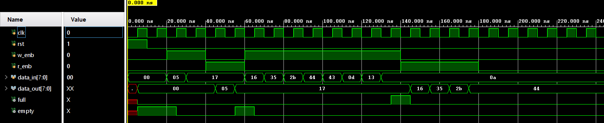
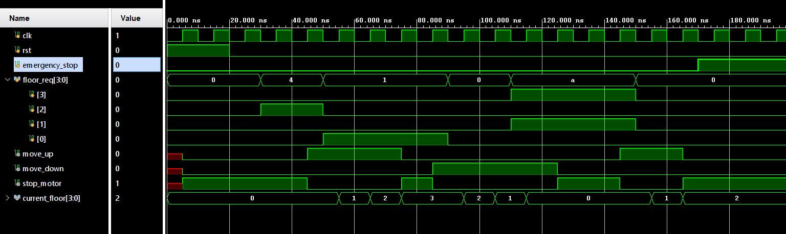

# Digital Design using Verilog HDL

## 📌 Overview
This repository contains the implementation and verification of fundamental digital circuits using Verilog HDL. The work focuses on developing strong RTL design and testbench skills for reliable digital system design.

## 🎯 Objective
To build a solid foundation in digital design by implementing key RTL modules and validating their functionality through simulation.

## 🛠 Tools & Environment
- Verilog HDL
- ModelSim / Vivado
- Simulation-based verification

## ⚙️ Implemented Modules

### 🔹 FIFO (First-In First-Out)
- Synchronous FIFO design using circular buffer architecture
- FULL and EMPTY flag handling
- Read/write control logic

### 🔹 RAM
- Parameterized memory module
- Read and write operations
- Address-based data access

### 🔹 FSM-Based Controller
- Finite State Machine design for control logic
- Sequential state transitions
- Behavioral modeling

### 🔹 Hamming Code (Error Detection & Correction)
- Implementation of error detection and correction logic
- Encoding and decoding mechanism

## 🧪 Verification Approach
- Developed testbenches for each module
- Functional validation using waveform analysis
- Verified correct operation under different input conditions

## 🖼️ Simulation Results

### FIFO Waveform

### FSM Output

## 🧠 Key Learnings
- RTL design methodology and coding practices
- Sequential vs combinational logic design
- Timing and control logic implementation
- Importance of testbench-driven verification

## 🚀 Outcome
This work strengthens the digital design foundation required for system-level and mixed-signal IC design.
